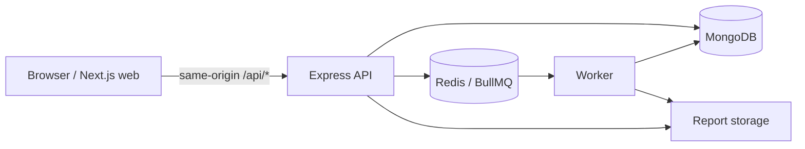

# Credora AI architecture

Credora is a workspace with a Next.js App Router frontend (`apps/web`), an Express REST API (`apps/api`), and a BullMQ worker (`apps/worker`). The web app rewrites same-origin `/api/*` traffic to `API_ORIGIN`, keeping browser cookies scoped to the web origin while the API owns validation, authorization, persistence, and job creation.

MongoDB stores users, sessions, analyses, profiles, scenarios, plans, reports, flags, models, and audit records. Redis backs BullMQ queues for reports, AI, portfolio snapshots, and cleanup. Every user-owned query includes `ownerId`; admins follow explicit role-protected paths.

Report generation and download share one workspace-relative storage contract (`storage/reports` unless `REPORT_STORAGE_DIR` is supplied). Both the API and worker import this path helper, preventing process working-directory differences from breaking completed report downloads. A report stores its type and the exact deterministic model version that created it; the worker includes that version and the simulator disclaimer in the PDF. Production replaces this local store with the configured object-storage integration.

The risk engine is deterministic and contains no protected-class inputs. The AI provider contract supports OpenAI, Anthropic, OpenRouter, Groq, Together AI, Ollama/local, optional Gemini, and mock/offline providers. AI only synthesizes explanations; it never determines a score.

The Next.js UI is organized into public marketing, authenticated workspace, and admin route groups. It uses a dark fintech/glass visual system, interactive visualizations, responsive layouts, deliberate motion, and reduced-motion alternatives.

